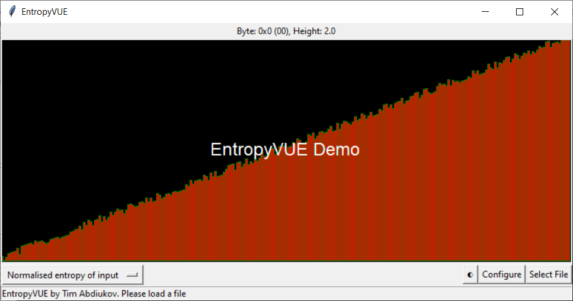

# EntropyVUE

EntropyVUE is a Python-based application that visualizes the entropy of a file. It uses Tkinter library for the GUI and requires no outside dependencies.



## Features

- **Interactive Visualization** (vue): The application provides an interactive visualization of the entropy of the selected file against several entropy algorithms.
- **Cross-Platform**: EntropyVUE uses Python and Python Tkinter library for the GUI and requires no outside dependencies.
- **Customizability**: Users can configure the `MAX_HEIGHT`, `ALPHABET`, and `Scale` parameters. The user may use `ALPHABET` values over the span of 1 byte.

## Usage

You can start the program by double-clicking on `vue.py`, or by passing `vue.py` to Python,
```bash
python vue.py
```

The program will start in "demo" mode, and you can specify a file to open using "Select File" button.

Alternatively, you can run the program from the command line with the `-f` or `--file` option

```bash
python vue.py -f /path/to/file
```

## Discover EntropyVUE Interactivity

* How does a text file (such as this README) entropy look, compared to a ZIP archive?
* How does a deflate ZIP archive file entropy look, compared to a highly compressed RAR or 7-zip archive file?
* How does an MP3 file entropy look, compared to a WAV file?

[what other information can be derived from these readings?]

-----------------------------------

**Tim Abdiukov**
