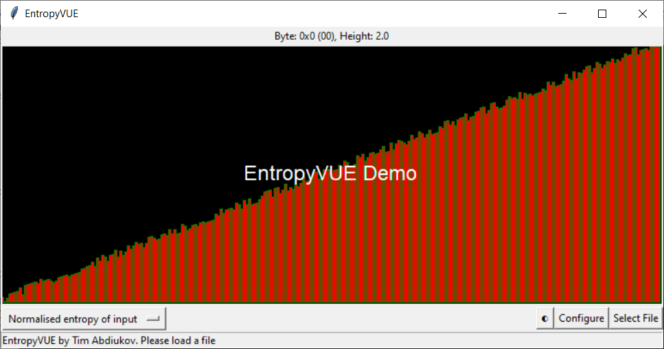

# EntropyVUE

[](https://github.com/TAbdiukov/EntropyVUE)


[](https://www.buymeacoffee.com/tabdiukov)

Visualise the structure and entropy of files.

It uses Tkinter, has no third-party dependencies, and requires Python 3.10 or newer.


 |
---- | 

## Features

- **Interactive Visualisation** (*Vue*): The application displays normalised symbol-count profiles, log-scaled count profiles, and Shannon entropy for the selected file.
- **Cross-Platform**: EntropyVUE uses cross-platform Python and the embedded Tkinter library for the GUI.
- **Customisability**: Users can configure the `MAX_HEIGHT`, `ALPHABET`, and `Scale` parameters. `ALPHABET` controls the number of symbol bins. Values up to 256 map individual bytes into bins; larger values use fixed-width multi-byte symbols.

## Displayed measurements

- **Normalised symbol-count profile**: Raw symbol/bin counts scaled to the chart height. This is a distribution profile, not an entropy metric.
- **Normalised log2/log10 count profile**: Log-scaled count profiles for exposing low-frequency structure.
- **Shannon entropy of input**: Shannon entropy over the observed symbol/bin distribution, reported in bits per symbol.
- **Shannon entropy of log2-transformed counts**: Shannon entropy over the log2-transformed count distribution.

## Usage

You can start the program by double-clicking on `vue.py`, or by passing `vue.py` to Python,
```bash
python vue.py
```

The program will start in "demo" mode, and you can specify a file to open using the "Select File" button.

Alternatively, you can run the program from the command line with the `-f` or `--file` option

```bash
python vue.py -f /path/to/file
```

## Discover EntropyVUE interactivity

* How does a text file's symbol-count profile compare to a ZIP archive?
* How does a deflate ZIP archive compare to a compressed RAR or 7-zip archive?
* What changes in distribution shape and Shannon entropy between an MP3 file and a WAV file?
* How does a JPG file compare to a PNG file?

What additional structure can be extracted from these distribution and entropy readings?

-----------------------------------

**Tim Abdiukov**
